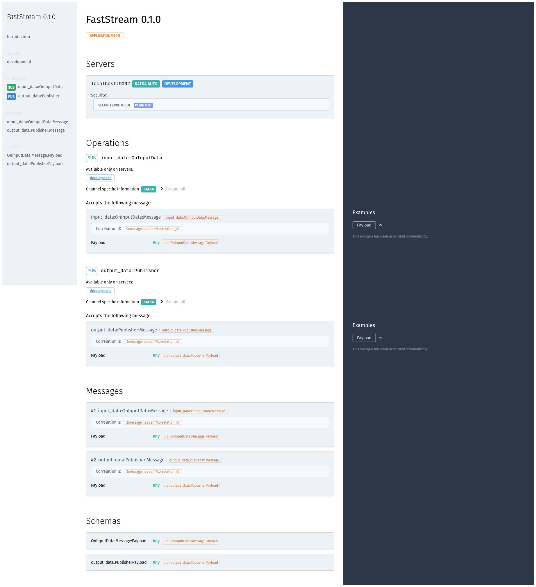
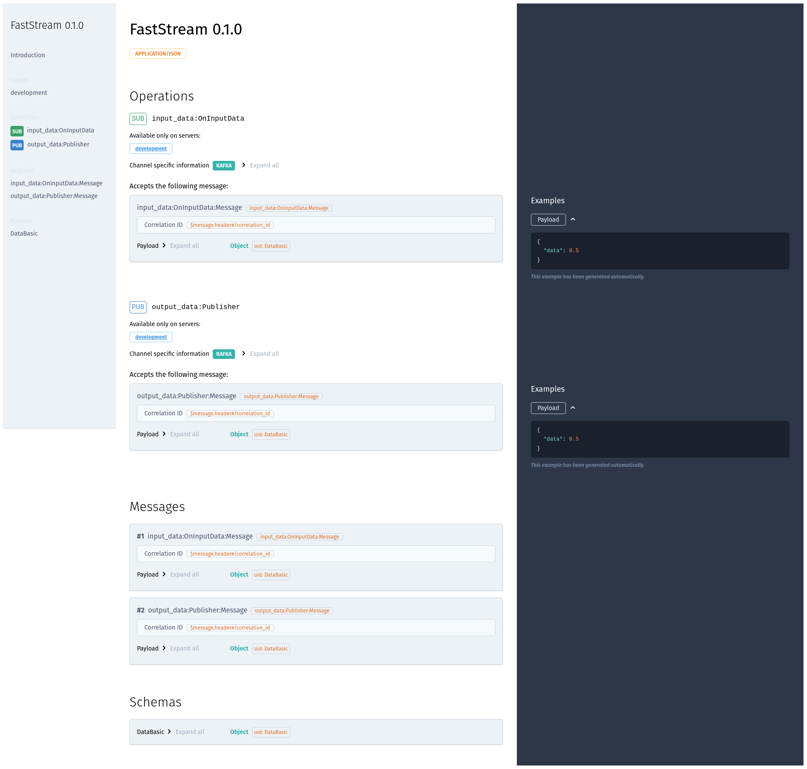

---
# 0.5 - API
# 2 - Release
# 3 - Contributing
# 5 - Template Page
# 10 - Default
search:
  boost: 10
---

# Serving the AsyncAPI Documentation

## Using CLI and http.server

**FastStream** provides a command to serve the **AsyncAPI** documentation.

!!! note
    This feature requires an Internet connection to obtain the **AsyncAPI HTML** via **CDN**.

```shell
{! docs_src/getting_started/asyncapi/serve.py [ln:17] !}
```

In the above command, the path is specified in the format of `python_module:FastStream`. Alternatively, you can also specify `asyncapi.json` or `asyncapi.yaml` to serve the **AsyncAPI** documentation.

=== "JSON"
    ```shell
    {!> docs_src/getting_started/asyncapi/serve.py [ln:21] !}
    ```

=== "YAML"
    ```shell
    {!> docs_src/getting_started/asyncapi/serve.py [ln:25] !}
    ```

After running the command, the **AsyncAPI** documentation will be served on port **8000**, and the terminal should display the following logs.

```{.shell .no-copy}
INFO:     Started server process [2364992]
INFO:     Waiting for application startup.
INFO:     Application startup complete.
INFO:     Uvicorn running on http://localhost:8000 (Press CTRL+C to quit)
```
{ data-search-exclude }

And you should be able to see the following page in your browser:

=== "Short"
    { .on-glb loading=lazy }

=== "Expand"
    { .on-glb loading=lazy }

!!! tip
    The command also offers options to serve the documentation on a different host and port.

## Built-in ASGI for FastStream Applications

FastStream includes lightweight [**ASGI** support](../asgi.md){.internal-link} that you can use to serve both your application and the **AsyncAPI** documentation.

```python linenums="1" hl_lines="1 3 11-15"
from faststream.asgi import AsgiFastStream
from faststream.kafka import KafkaBroker
from faststream.specification import AsyncAPI

broker = KafkaBroker()

@broker.subscriber('topic')
async def my_handler(msg: str) -> None:
    print(msg)

app = AsgiFastStream(
    broker,
    specification=AsyncAPI(),
    asyncapi_path="/docs/asyncapi",
)

if __name__ == "__main__":
    import uvicorn
    uvicorn.run(app, host="0.0.0.0", port=8000)
```

Also, you can configure AsyncAPI route behavior using a special class:

```python linenums="1" hl_lines="1 7"
from faststream.asgi import AsgiFastStream, AsyncAPIRoute
from faststream.specification import AsyncAPI

app = AsgiFastStream(
    ...,
    specification=AsyncAPI(),
    asyncapi_path=AsyncAPIRoute("/docs/asyncapi", include_in_schema=True),
)
```

After running the script, the **AsyncAPI** docs will be available at: <http://localhost:8000/docs/asyncapi>

## Try It Out

The AsyncAPI documentation page includes a built-in **Try It Out** feature that lets you publish test messages directly from the browser UI, without leaving the docs page.

!!! note
    The Try It Out UI is powered by the [asyncapi-try-it-plugin](https://github.com/Shepard2154/asyncapi-try-it-plugin){.external-link target="_blank"} — a plugin for AsyncAPI that adds a Swagger-like interface to send test messages to message brokers. Thanks to the maintainers for this functionality.

By default, when you set `asyncapi_path`, a companion `POST` endpoint is automatically registered at `{asyncapi_path}/try`. The UI sends the message payload to this endpoint, which publishes it to your broker in test mode (without requiring a real broker connection).

```python linenums="1" hl_lines="7"
from faststream.nats import NatsBroker
from faststream.asgi import AsgiFastStream

broker = NatsBroker()

# POST /docs/asyncapi/try is registered automatically
app = AsgiFastStream(broker, asyncapi_path="/docs/asyncapi")
```

To disable the feature, use `AsyncAPIRoute` with `try_it_out=False`:

```python linenums="1" hl_lines="2 8"
from faststream.nats import NatsBroker
from faststream.asgi import AsgiFastStream, AsyncAPIRoute

broker = NatsBroker()

app = AsgiFastStream(
    broker,
    asyncapi_path=AsyncAPIRoute("/docs/asyncapi", try_it_out=False),
)
```

If you want to point the Try It Out UI to an **external backend** (e.g. a separate service or a production broker URL), pass a custom `try_it_out_url` via `AsyncAPIRoute`:

```python linenums="1" hl_lines="2 10"
from faststream.nats import NatsBroker
from faststream.asgi import AsgiFastStream, AsyncAPIRoute

broker = NatsBroker()

app = AsgiFastStream(
    broker,
    asyncapi_path=AsyncAPIRoute(
        "/docs/asyncapi",
        try_it_out_url="https://api.example.com/asyncapi/try",
    ),
)
```

!!! note
    When `try_it_out_url` is set on `AsyncAPIRoute`, it overrides the URL the browser sends requests to. The local `POST {asyncapi_path}/try` endpoint is still registered and reachable regardless of `try_it_out_url`, unless you also pass `try_it_out=False`.

## Integration with Different HTTP Frameworks (**FastAPI** Example)

**FastStream** provides two robust approaches to combine your message broker documentation with any **ASGI** web frameworks.
You can choose the method that best fits with your application architecture.

=== "ASGI Application"
    ```python linenums="1" hl_lines="5 22"
    from typing import AsyncIterator
    from contextlib import asynccontextmanager

    from fastapi import FastAPI
    from faststream.asgi import make_asyncapi_asgi
    from faststream.specification import AsyncAPI
    from faststream.kafka import KafkaBroker

    broker = KafkaBroker()

    @broker.subscriber('topic')
    async def my_handler(msg: str) -> None:
        print(msg)

    @asynccontextmanager
    async def broker_lifespan(app: FastAPI) -> AsyncIterator[None]:
        async with broker:
            await broker.start()
            yield

    app = FastAPI(lifespan=broker_lifespan)
    app.mount("/docs/asyncapi", make_asyncapi_asgi(AsyncAPI(broker)))
    ```

=== "Any HTTP Application"
    ```python linenums="1" hl_lines="23-26"
    from typing import AsyncIterator
    from contextlib import asynccontextmanager

    from fastapi import FastAPI, responses
    from faststream.specification import get_asyncapi_html, AsyncAPI
    from faststream.kafka import KafkaBroker

    broker = KafkaBroker()

    @broker.subscriber('topic')
    async def my_handler(msg: str) -> None:
        print(msg)

    @asynccontextmanager
    async def broker_lifespan(app: FastAPI) -> AsyncIterator[None]:
        async with broker:
            await broker.start()
            yield

    app = FastAPI(lifespan=broker_lifespan)

    @app.get('/docs/asyncapi')
    async def docs() -> responses.HTMLResponse:
        specification = AsyncAPI(broker).to_specification()
        return responses.HTMLResponse(get_asyncapi_html(specification))
    ```

After running the app, the documentation will be available at:

* OpenAPI Docs: <http://localhost:8000/docs>
* AsyncAPI Docs: <http://localhost:8000/docs/asyncapi>

## Customizing AsyncAPI Documentation

FastStream also provides query parameters to show and hide specific sections of AsyncAPI documentation.

You can use the following parameters control the visibility of relevant sections:

1. `sidebar`: Whether to include the sidebar. Default is true.
1. `info`: Whether to include the info section. Default is true.
1. `servers`: Whether to include the servers section. Default is true.
1. `operations`: Whether to include the operations section. Default is true.
1. `messages`: Whether to include the messages section. Default is true.
1. `schemas`: Whether to include the schemas section. Default is true.
1. `errors`: Whether to include the errors section. Default is true.
1. `expandMessageExamples`: Whether to expand message examples. Default is true.

For example, to hide the entire `Servers` section of the documentation, simply add `servers=false` as a query parameter, i.e., <http://localhost:8000?servers=false>. The resulting page would look like the image below:

{ .on-glb loading=lazy }

Please use the above-listed query parameters to show and hide sections of the AsyncAPI documentation.
