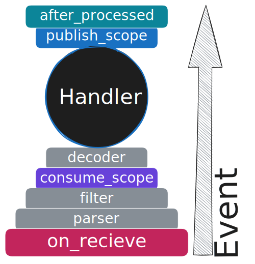

---
# 0.5 - API
# 2 - Release
# 3 - Contributing
# 5 - Template Page
# 10 - Default
search:
  boost: 10
---

# Middlewares

**Middlewares** are a powerful tool that allows you to add extra logic to any part of the message processing pipeline.

This way, you can significantly enhance your **FastStream** application with features such as:

- Integration with various logging and metrics systems
- Application-level message serialization logic
- Extensive publication of messages with additional information
- And numerous other capabilities

**Middlewares** have several methods that can be overridden. You can choose to implement some or all of these methods.

You need to import only the BaseMiddleware, as it contains all the necessary methods. All available methods can be overridden:

```python linenums="1" hl_lines="10 16 25 34"
from types import TracebackType
from typing import Any, Awaitable, Callable, Optional
from faststream import BaseMiddleware
from faststream.message import StreamMessage
from faststream.response import PublishCommand

class MyMiddleware(BaseMiddleware):
    # Use this if you want to add logic when a message is received for the first time,
    # such as logging incoming messages, validating headers, or setting up the context.
    async def on_receive(self) -> Any:
        print(f"Received: {self.msg}")
        return await super().on_receive()

    # Use this if you want to wrap the entire message processing process,
    # such as implementing retry logic, circuit breakers, rate limiting, or authentication.
    async def consume_scope(
        self,
        call_next: Callable[[StreamMessage[Any]], Awaitable[Any]],
        msg: StreamMessage[Any],
    ) -> Any:
        return await call_next(msg)

    # Use this if you want to customize outgoing messages before they are sent,
    # such as adding encryption, compression, or custom headers.
    async def publish_scope(
        self,
        call_next: Callable[[PublishCommand], Awaitable[Any]],
        cmd: PublishCommand,
    ) -> Any:
        return await super().publish_scope(call_next, cmd)

    # Use this if you want to perform post-processing tasks after message handling has completed,
    # such as cleaning up, logging errors, collecting metrics, or committing transactions.
    async def after_processed(
        self,
        exc_type: type[BaseException] | None = None,
        exc_val: BaseException | None = None,
        exc_tb: Optional[TracebackType] = None,
    ) -> bool | None:
        return await super().after_processed(exc_type, exc_val, exc_tb)
```

PayAttention to the order: the methods are executed in this sequence after each stage. Read more below in [Middlewares Flow](#middlewares-flow).

**Middlewares** can be used Broker or [Router](../routers/index.md){.internal-link}. For example:

```python
broker = Broker(middlewares=[MyMiddleware])
# Or
router = BrokerRouter(middlewares=[MyMiddleware])
```

## Middlewares Flow

{ width=300 height=100 }

### What is on the diagram?

#### on_recieve

- explain
- explain

#### parser

- explain
- explain

## More about the publish_scope

**Publisher middlewares** affect all ways of publishing something, including the `#!python broker.publish` call.
If you want to intercept the publishing process, you will need to use the `publish_scope` method.

```python linenums="1"
from typing import Any, Awaitable, Callable
from faststream import BaseMiddleware
from faststream.response import PublishCommand

class MyMiddleware(BaseMiddleware):
async def publish_scope(
self,
call_next: Callable[[PublishCommand], Awaitable[Any]],
cmd: PublishCommand,
) -> Any:
return await super().publish_scope(call_next, cmd)

broker = Broker(middlewares=[MyMiddleware])
```

This method consumes the message body and any other options passed to the `publish` function (such as destination headers, etc.).

!!! note
    If you are using `publish_batch` somewhere in your app, your publisher middleware should consume `#!python *cmds` option additional

## Context Access

Middlewares can access the [Context](../context/index.md){.internal-link} for all available methods. For example:

```python linenums="1" hl_lines="8"
from faststream import BaseMiddleware

class ContextMiddleware(BaseMiddleware):
    # Context is also available for the following methods:
    # on_receive, after_processed and publish_scope.
    async def consume_scope(
        self,
        call_next: Callable[[StreamMessage[Any]], Awaitable[Any]],
        msg: StreamMessage[Any],
    ) -> Any:
        # Access context
        message_context = self.context.get_local("message")
        # Your middleware logic here
        return await call_next(msg)
```

## Examples

### Retry Middleware

```python
import asyncio
from typing import Any, Awaitable, Callable, Final
from typing_extensions import override
from faststream import BaseMiddleware
from faststream.message import StreamMessage

class RetryMiddleware(BaseMiddleware):
    MAX_RETRIES: Final[int] = 3

    @override
    async def consume_scope(
        self,
        call_next: Callable[[StreamMessage[Any]], Awaitable[Any]],
        msg: StreamMessage[Any],
    ) -> Any:
        for attempt in range(self.MAX_RETRIES + 1):
            try:
                return await call_next(msg)
            except Exception as e:
                if attempt == self.MAX_RETRIES:
                    print(f"Failed after {self.MAX_RETRIES} retries: {e}")
                    raise

                print(f"Attempt {attempt + 1} failed, retrying: {e}")
                await asyncio.sleep(2**attempt)  # Exponential backoff
        return None
```

## Facts

1. Please always call the `#!python super()` method at the end of your function. This is important for proper error handling.
2. The `msg` option always has the already decoded body. To prevent the default `#!python json.loads(...)` call, you should use a [custom decoder](../serialization/decoder.md){.internal-link} instead.
