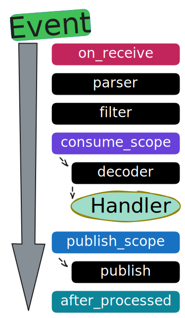

---
# 0.5 - API
# 2 - Release
# 3 - Contributing
# 5 - Template Page
# 10 - Default
search:
  boost: 10
---

# 🔗 Middlewares introduction

Middlewares in **FastStream** allow you to process messages before and after they are handled by your code.
This allows you to add common functionality to multiple handlers without duplicating code.

Middlewares help keep your business logic separate from the technical aspects of your application.

In this section, you will find a list of available middlewares and detailed information about how they work. You can also learn how to create your own middleware.

---

## 🌊 Basic: Middlewares Flow

{ width=300 height=100 }

It is important to mention the **`parser`**, **`filter`**, **`decoder`** and **`publish`** - they are service functions, FastStream uses them during event processing. More details below:

1. **on_receive** - This method is called first for every incoming message, regardless of whether the message will be processed.
2. [**parser**](../serialization/parser.md){.internal-link} - Converts native broker messages (aiopika, aiokafka, redis, etc.) into FastStream's StreamMessage format
3. [**filter**](../subscription/filtering.md){.internal-link} - Applies filtering logic based on user-defined filter parameters.
4. [**consume_scope**](../subscription/index.md){.internal-link} - If the filter passes, the flow continues. Otherwise, it stops here.
    - [**decoder**](../serialization/decoder.md){.internal-link} - Deserializes message bytes into dictionaries or structured data.
    - **Handler** - Executes the message handling function
5. [**publish_scope**](../publishing/decorator.md){.internal-link} - For each `@publisher` decorator, the function is called (if there are 4 publishers, the function will be called 4 times).
    - [**publish**](../publishing/index.md){.internal-link} - The publish_scope calls the publish method, and the result of the handler you return will be used as the argument for sending the message.
6. **after_processed** - Final cleanup and post-processing stage.

## 💡 The most common scenario

```python linenums="1" hl_lines="8 18 23"
from types import TracebackType

from faststream import BaseMiddleware


class MyMiddleware(BaseMiddleware):
    async def on_receive(self) -> None:
        # All events are included here, without any filters or other side effects.
        print(f"Received: {self.msg}")
        return await super().on_receive()

    async def after_processed(
        self,
        exc_type: type[BaseException] | None = None,
        exc_val: BaseException | None = None,
        exc_tb: TracebackType | None = None,
    ) -> bool | None:
        if exc_type:  # Catch the error if it occurred in your handler
            ...
        return await super().after_processed(exc_type, exc_val, exc_tb)


# You can register them to the broker or router scopes.
broker = Broker(middlewares=[MyMiddleware])  # global scope
# Or
router = BrokerRouter(middlewares=[MyMiddleware])  # router scope
```

**Middlewares** can be used Broker scope or [Router](../routers/index.md){.internal-link} scope.

## 🛠️ Full middleware methods

```python linenums="1" hl_lines="8-9 14-15 23-24 32-33"
from types import TracebackType
from typing import Any, Awaitable, Callable

from faststream import BaseMiddleware, PublishCommand, StreamMessage


class MyMiddleware(BaseMiddleware):
    # Use this if you want to add logic when a message is received for the first time,
    # such as logging incoming messages, validating headers, or setting up the context.
    async def on_receive(self) -> Any:
        print(f"Received: {self.msg}")
        return await super().on_receive()

    # Use this if you want to wrap the entire message processing process,
    # such as implementing retry logic, circuit breakers, rate limiting, or authentication.
    async def consume_scope(
        self,
        call_next: Callable[[StreamMessage[Any]], Awaitable[Any]],
        msg: StreamMessage[Any],
    ) -> Any:
        return await call_next(msg)

    # Use this if you want to customize outgoing messages before they are sent,
    # such as adding encryption, compression, or custom headers.
    async def publish_scope(
        self,
        call_next: Callable[[PublishCommand], Awaitable[Any]],
        cmd: PublishCommand,
    ) -> Any:
        return await super().publish_scope(call_next, cmd)

    # Use this if you want to perform post-processing tasks after message handling has completed,
    # such as cleaning up, logging errors, collecting metrics, or committing transactions.
    async def after_processed(
        self,
        exc_type: type[BaseException] | None = None,
        exc_val: BaseException | None = None,
        exc_tb: TracebackType | None = None,
    ) -> bool | None:
        return await super().after_processed(exc_type, exc_val, exc_tb)
```

PayAttention to the order: the methods are executed in this sequence after each stage. Read more below in [Middlewares Flow](#basic-middlewares-flow).

### ❗ **Important** information about **`filter`**

It is important to note that if the event does not pass the filter, the rest of the process will be aborted.
This means that the functions `consume_scope`, `decoder`, `handler`, `publish_scope`, `publish` and `after_processed` will not be executed.

### ❗ **Important** information about **`consume_scope`**

1. **consume_scope** makes calls before the [**decoding stage**](#basic-middlewares-flow). The `#!python msg: StreamMessage` is a native FastStream Object, which means the message is still serialized.
2. To differentiate between different types of subscribers, you can use `#!python msg.source_type`. It can be one of the following `Enum`:
    - `CONSUME`: Message consumed by basic subscriber flow.
    - `RESPONSE`: RPC response consumed.

### ❗ **Important** information about **`publish_scope`**

1. If you want to intercept the publishing process, you will need to use the **publish_scope** method.
2. This method consumes the message body and any other options passed to the `publish` method (such as destination headers, etc.).
3. **publish_scope** affect all ways of publishing something, including the `#!python broker.publish` call.
4. To differentiate between different types of publishers, you can use `cmd.publish_type`. It can be one of the following `Enum`:
    - `PUBLISH`: Regular `broker/publisher.publish(...)` call.
    - `REPLY`: Response to RPC/Reply-To request.
    - `REQUEST`: RPC request call.
5. **Batch Publishing**: When you publish multiple messages at once using the `broker.publish_batch(...)` method, the `publish_scope` receives a `BatchPublishCommand` object. This object holds all the messages to be sent in its `cmd.batch_bodies` attribute. This feature is useful for intercepting and modifying the batch publication process.

#### ✨ If the basic PublishCommand does not meet your needs, you can use the extended option. Here is an example:

=== "Default"
    ```python linenums="1"
    from typing import Any, Awaitable, Callable

    from faststream import BaseMiddleware, PublishCommand


    class DefaultPublishMiddleware(BaseMiddleware):
        async def publish_scope(
            self,
            call_next: Callable[[PublishCommand], Awaitable[Any]],
            cmd: PublishCommand,
        ) -> Any:
            return await super().publish_scope(call_next, cmd)
    ```

=== "Batch"
    ```python linenums="1"
    from typing import Any, Awaitable, Callable

    from faststream import BaseMiddleware, BatchPublishCommand


    class BatchPublishMiddleware(BaseMiddleware[BatchPublishCommand]):
        async def publish_scope(
            self,
            call_next: Callable[[BatchPublishCommand], Awaitable[Any]],
            cmd: BatchPublishCommand,
        ) -> Any:
            # you can access `cmd.batch_bodies` here
            return await super().publish_scope(call_next, cmd)
    ```

=== "AIOKafka"
    ```python linenums="1"
    from typing import Any, Awaitable, Callable

    from faststream import BaseMiddleware
    from faststream.kafka import KafkaPublishCommand


    class KafkaPublishMiddleware(BaseMiddleware[KafkaPublishCommand]):
        async def publish_scope(
            self,
            call_next: Callable[[KafkaPublishCommand], Awaitable[Any]],
            cmd: KafkaPublishCommand,
        ) -> Any:
            return await super().publish_scope(call_next, cmd)
    ```

=== "Confluent"
    ```python linenums="1"
    from typing import Any, Awaitable, Callable

    from faststream import BaseMiddleware
    from faststream.confluent import KafkaPublishCommand


    class KafkaPublishMiddleware(BaseMiddleware[KafkaPublishCommand]):
        async def publish_scope(
            self,
            call_next: Callable[[KafkaPublishCommand], Awaitable[Any]],
            cmd: KafkaPublishCommand,
        ) -> Any:
            return await super().publish_scope(call_next, cmd)
    ```

=== "RabbitMQ"
    ```python linenums="1"
    from typing import Any, Awaitable, Callable

    from faststream import BaseMiddleware
    from faststream.rabbit import RabbitPublishCommand


    class RabbitPublishMiddleware(BaseMiddleware[RabbitPublishCommand]):
        async def publish_scope(
            self,
            call_next: Callable[[RabbitPublishCommand], Awaitable[Any]],
            cmd: RabbitPublishCommand,
        ) -> Any:
            return await super().publish_scope(call_next, cmd)
    ```

=== "NATS"
    ```python linenums="1"
    from typing import Any, Awaitable, Callable

    from faststream import BaseMiddleware
    from faststream.nats import NatsPublishCommand


    class NatsPublishMiddleware(BaseMiddleware[NatsPublishCommand]):
        async def publish_scope(
            self,
            call_next: Callable[[NatsPublishCommand], Awaitable[Any]],
            cmd: NatsPublishCommand,
        ) -> Any:
            return await super().publish_scope(call_next, cmd)
    ```

=== "Redis"
    ```python linenums="1"
    from typing import Any, Awaitable, Callable

    from faststream import BaseMiddleware
    from faststream.redis import RedisPublishCommand


    class RedisPublishMiddleware(BaseMiddleware[RedisPublishCommand]):
        async def publish_scope(
            self,
            call_next: Callable[[RedisPublishCommand], Awaitable[Any]],
            cmd: RedisPublishCommand,
        ) -> Any:
            return await super().publish_scope(call_next, cmd)
    ```

## 📦 Context Access

Middlewares can access the [Context](../context/){.internal-link} for all available methods. For example:

```python linenums="1" hl_lines="9"
from collections.abc import Awaitable, Callable
from typing import Any

from faststream import BaseMiddleware
from faststream.message import StreamMessage


class ContextMiddleware(BaseMiddleware):
    # Context is also available in the on_receive, consume_scope, publish_scope, and after_processed methods.
    async def consume_scope(
        self,
        call_next: Callable[[StreamMessage[Any]], Awaitable[Any]],
        msg: StreamMessage[Any],
    ) -> Any:
        message_context = self.context.get_local("message")
        return await call_next(msg)
```

## 🚀 Real examples

### 🔁 Retry Middleware

```python linenums="1"
import asyncio
from collections.abc import Awaitable, Callable
from typing import Any, Final

from typing_extensions import override

from faststream import BaseMiddleware, FastStream, Logger
from faststream.message import StreamMessage
from faststream.redis import RedisBroker


class RetryMiddleware(BaseMiddleware):
    MAX_RETRIES: Final[int] = 3

    @override
    async def consume_scope(
        self,
        call_next: Callable[[StreamMessage[Any]], Awaitable[Any]],
        msg: StreamMessage[Any],
    ) -> Any:
        logger: Logger = self.context.get_local("logger")
        for attempt in range(self.MAX_RETRIES + 1):
            try:
                return await call_next(msg)
            except Exception:
                if attempt == self.MAX_RETRIES:
                    logger.exception("Failed after %s retries: ", self.MAX_RETRIES)
                    raise

                logger.exception("Attempt %s failed, retrying: ", attempt + 1)
                await asyncio.sleep(2**attempt)  # Exponential backoff
        return None


broker = RedisBroker(middlewares=[RetryMiddleware])
app = FastStream(broker)
```

## 📝 Summary

Middlewares provide a powerful way to extend FastStream's message processing pipeline at specific stages. Key points to remember:

1. [**Order of execution matters**](#basic-middlewares-flow) - Methods are called in a specific sequence: `on_receive` → parser → filter → `consume_scope` → decoder → handler → `publish_scope` → publish → `after_processed`.
2. [**Conditional Execution**](../subscription/filtering.md){.internal-link} - If a message fails to pass the filter, `consume_scope` and subsequent stages will be skipped.
3. **Multiple publish calls** - The `publish_scope` function is executed once for each `@publisher` decorator in your handler.
4. **Chain Continuation** - To maintain the middleware chain, it is important to always call the super() method or call the next function. This ensures proper error handling and prevents issues with the chain.
5. [**Context Access**](../context/index.md){.internal-link} - All middleware methods have access to the FastStream context for shared state management.
6. [**Broker-specific extensions**](#important-information-about-publish_scope) - Use typed publish commands (KafkaPublishCommand, RabbitPublishCommand, etc.) to provide specific functionality for different brokers.

Choose the right middleware method based on your specific needs: `on_receive` to handle all incoming messages, `consume_scope` to process data, `publish_scope` to send outgoing messages, and `after_processed` to perform cleanup tasks.
