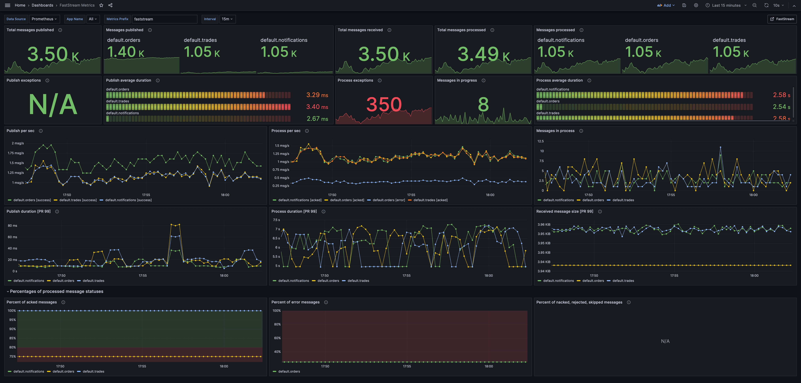

---
# 0.5 - API
# 2 - Release
# 3 - Contributing
# 5 - Template Page
# 10 - Default
search:
  boost: 10
---

# Prometheus

[**Prometheus**](https://prometheus.io/){.external-link target="_blank"} is an open-source monitoring and alerting toolkit originally built at SoundCloud.
With a focus on reliability, robustness, and easy scalability, **Prometheus** allows users to collect metrics,
scrape data from various sources, store them efficiently, and query them in real-time. Its flexible data model,
powerful query language, and seamless integration with [**Grafana**](https://grafana.com/){.external-link target="_blank"} make it a popular choice for monitoring the health
and performance of systems and applications.

### FastStream Metrics

To add a metrics to your broker, you need to:

1. Install `FastStream` with `prometheus-client`

    ```shell
    pip install 'faststream[prometheus]'
    ```

2. Add `PrometheusMiddleware` to your broker

=== "AIOKafka"
    ```python linenums="1" hl_lines="6 10"
    {!> docs_src/getting_started/prometheus/kafka.py!}
    ```

=== "Confluent"
    ```python linenums="1" hl_lines="6 10"
    {!> docs_src/getting_started/prometheus/confluent.py!}
    ```

=== "RabbitMQ"
    ```python linenums="1" hl_lines="6 10"
    {!> docs_src/getting_started/prometheus/rabbit.py!}
    ```

=== "NATS"
    ```python linenums="1" hl_lines="6 10"
    {!> docs_src/getting_started/prometheus/nats.py!}
    ```

=== "Redis"
    ```python linenums="1" hl_lines="6 10"
    {!> docs_src/getting_started/prometheus/redis.py!}
    ```

### Exposing the `/metrics` endpoint
The way Prometheus works requires the service to expose an HTTP endpoint for analysis.
By convention, this is a GET endpoint, and its path is usually `/metrics`.

FastStream's built-in **ASGI** support allows you to expose endpoints in your application.

A convenient way to serve this endpoint is to use `make_asgi_app` from `prometheus_client`,
passing in the registry that was passed to `PrometheusMiddleware`.

=== "AIOKafka"
    ```python linenums="1" hl_lines="6 10 13 16"
    {!> docs_src/getting_started/prometheus/kafka_asgi.py!}
    ```

=== "Confluent"
    ```python linenums="1" hl_lines="6 10 13 16"
    {!> docs_src/getting_started/prometheus/confluent_asgi.py!}
    ```

=== "RabbitMQ"
    ```python linenums="1" hl_lines="6 10 13 16"
    {!> docs_src/getting_started/prometheus/rabbit_asgi.py!}
    ```

=== "NATS"
    ```python linenums="1" hl_lines="6 10 13 16"
    {!> docs_src/getting_started/prometheus/nats_asgi.py!}
    ```

=== "Redis"
    ```python linenums="1" hl_lines="6 10 13 16"
    {!> docs_src/getting_started/prometheus/redis_asgi.py!}
    ```

---

### Exported metrics












| Metric                                           | Type          | Description                                                    | Labels                                                |
|--------------------------------------------------|---------------|----------------------------------------------------------------|-------------------------------------------------------|
| **received_messages_total**                      | **Counter**   | {{ received_messages_total_description }}                      | `app_name`, `broker`, `handler`                       |
| **received_messages_size_bytes**                 | **Histogram** | {{ received_messages_size_bytes_description }}                 | `app_name`, `broker`, `handler`                       |
| **received_messages_in_process**                 | **Gauge**     | {{ received_messages_in_process_description }}                 | `app_name`, `broker`, `handler`                       |
| **received_processed_messages_total**            | **Counter**   | {{ received_processed_messages_total_description }}            | `app_name`, `broker`, `handler`, `status`             |
| **received_processed_messages_duration_seconds** | **Histogram** | {{ received_processed_messages_duration_seconds_description }} | `app_name`, `broker`, `handler`                       |
| **received_processed_messages_exceptions_total** | **Counter**   | {{ received_processed_messages_exceptions_total_description }} | `app_name`, `broker`, `handler`, `exception_type`     |
| **published_messages_total**                     | **Counter**   | {{ published_messages_total_description }}                     | `app_name`, `broker`, `destination`, `status`         |
| **published_messages_duration_seconds**          | **Histogram** | {{ published_messages_duration_seconds_description }}          | `app_name`, `broker`, `destination`                   |
| **published_messages_exceptions_total**          | **Counter**   | {{ published_messages_exceptions_total_description }}          | `app_name`, `broker`, `destination`, `exception_type` |

### Labels

| Label                             | Description                                                     | Values                                            |
|-----------------------------------|-----------------------------------------------------------------|---------------------------------------------------|
| app_name                          | The name of the application, which the user can specify himself | `faststream` by default                           |
| broker                            | Broker name                                                     | `kafka`, `rabbit`, `nats`, `redis`                |
| handler                           | Where the message came from                                     |                                                   |
| status (while receiving)          | Message processing status                                       | `acked`, `nacked`, `rejected`, `skipped`, `error` |
| exception_type (while receiving)  | Exception type when processing message                          |                                                   |
| status (while publishing)         | Message publishing status                                       | `success`, `error`                                |
| destination                       | Where the message is sent                                       |                                                   |
| exception_type (while publishing) | Exception type when publishing message                          |                                                   |

### Integrate custom metrics
To integrate your custom metrics with FastStream, you should declare the metric, specifying the **same registry** that you passed to middleware.

```python linenums="1" hl_lines="1 6 7 11 18-19"
{!> docs_src/getting_started/prometheus/kafka_custom_metric.py!}
```

To learn about all the metric types supported by the `prometheus_client` Python library, check out the official instrumentation [**documentation**](https://prometheus.github.io/client_python/instrumenting/){.external-link target="_blank"}.

### Grafana dashboard

You can import the [**Grafana dashboard**](https://grafana.com/grafana/dashboards/22130-faststream-metrics/){.external-link target="_blank"} to visualize the metrics collected by middleware.

Enter the dashboard **URL** `https://grafana.com/grafana/dashboards/22130-faststream-metrics/` (or just the **ID**, `22130`), and click on **Load**.

{ .on-glb loading=lazy }
`Import dashboard`

An [example](https://github.com/draincoder/faststream-monitoring){.external-link target="_blank"} application with configured **metrics**, **Prometheus** and **Grafana**.

{ .on-glb loading=lazy }
`Grafana dashboard`
