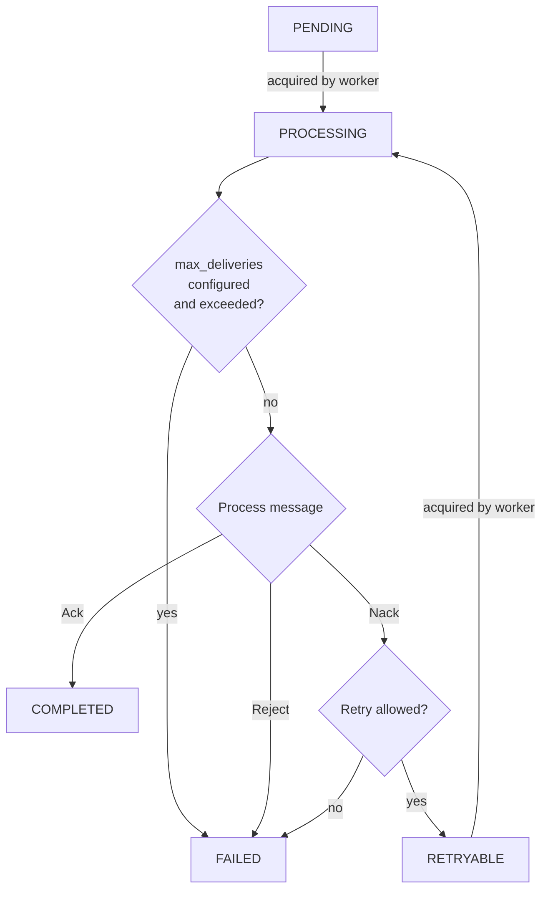

---
# 0.5 - API
# 2 - Release
# 3 - Contributing
# 5 - Template Page
# 10 - Default
search:
  boost: 10
---

# Design

### Message Lifecycle

A published message starts out as `PENDING`. When it is acquired by a worker, it is marked as `PROCESSING`, which prevents it from being acquired by other worker processes. If the maximum allowed number of deliveries is configured and exceeded, the message is marked as `FAILED`. If not, the message is processed. If processing didn't raise an exception or if the message was manually Ack'ed in the handler, it is marked as `COMPLETED`. If the message was manually Nack'ed or Reject'ed or if processing raised an exception and [`AckPolicy`](../getting-started/acknowledgement.md){.internal-link} was set to `REJECT_ON_ERROR` or `NACK_ON_ERROR`, the message is Nack'ed or Reject'ed. Reject'ed messages are marked as `FAILED`. For Nack'ed messages, the retry policy determines if the message is allowed to be retried. If retry is allowed, the message is marked as `RETRYABLE`. If not, the message is marked as `FAILED`.

`PENDING`, `PROCESSING`, and `RETRYABLE` messages reside in the main table, while `COMPLETED` and `FAILED` messages are moved to the archive table on status change.

### Subscriber Internals

On start, the subscriber spawns four types of concurrent loops:

**1. Fetch loop** &mdash; Periodically fetches batches of `PENDING` or `RETRYABLE` messages from the database, simultaneously updating them: marking as `PROCESSING`, setting `acquired_at` to now, and incrementing `deliveries_count`. Only messages with `next_attempt_at <= now` are fetched, ordered by `next_attempt_at`. The fetched messages are placed into an internal queue. The fetch limit is the minimum of `fetch_batch_size` and the free buffer capacity (`fetch_batch_size * overfetch_factor` minus currently queued messages). If the last fetch was "full" (returned as many messages as the limit), the next fetch happens after `min_fetch_interval`; otherwise after `max_fetch_interval`.

**2. Worker loops** (`max_workers` concurrent instances) &mdash; Each worker takes a message from the internal queue and first checks if `max_deliveries` has been exceeded; if so, the message is Rejected without processing. Otherwise, processing proceeds. Depending on the processing result, [`AckPolicy`](../getting-started/acknowledgement.md){.internal-link}, and manual Ack/Nack/Reject, the message is Ack'ed, Nack'ed, or Rejected. For Nack'ed messages, the `retry_strategy` is consulted to determine if and when the message might be retried. If allowed to be retried, the message is marked as `RETRYABLE`; otherwise as `FAILED`. Ack'ed messages are marked as `COMPLETED` and rejected messages are marked as `FAILED`. The message is then buffered for flushing.

**3. Flush loop** &mdash; Periodically flushes the buffered message state changes to the database. `COMPLETED` and `FAILED` messages are moved from the primary table to the archive table. The state of `RETRYABLE` messages is updated in the primary table.

**4. Release stuck loop** &mdash; Periodically releases messages that have been stuck in `PROCESSING` state for longer than `release_stuck_timeout` since `acquired_at`. These messages are marked back as `PENDING`.

On stop, all loops are gracefully stopped. Messages that have been acquired but are not yet being processed are drained from the internal queue and marked back as `PENDING`. The subscriber waits for all tasks to complete within `graceful_timeout`, then performs a final flush.

### Processing Guarantees

This design adheres to the **"at least once"** processing guarantee because flushing changes to the database happens only after a processing attempt. A flush might not happen due to e.g. a crash. This might lead to messages being processed more times than allowed by the `retry_strategy`, and to the database state being inconsistent with the true number of attempts.

### Work Sharing

This design allows for work sharing between processes and nodes because `SELECT ... FOR UPDATE SKIP LOCKED` is utilized. Multiple subscriber instances (in different processes or on different machines) can safely consume from the same queue without double-processing.

### Transactions

This design opts for separate short-lived transactions instead of a single one. This first one fetches messages with `SELECT ... FOR UPDATE SKIP LOCKED` and sets their state to `PROCESSING`, which prevents them from being fetched by other processes/nodes. The other two transactions flush message state updates to the database.

### Poison Message Protection

Setting `max_deliveries` to a non-`None` value provides protection from the [poison message problem](https://www.rabbitmq.com/docs/quorum-queues#poison-message-handling){.external-link target="_blank"} (messages that crash the worker without the ability to catch the exception, e.g. due to OOM terminations) because `deliveries_count` is incremented and `max_deliveries` is checked prior to a processing attempt. However, this comes at the expense of potentially over-counting deliveries, especially for messages that are being processed concurrently with the poison message (a crash would leave them with incremented `deliveries_count` despite possibly not having been processed), and violating the at-most-once processing semantics.

### Why Not LISTEN/NOTIFY?

`LISTEN/NOTIFY` is specific to PostgreSQL, while it is preferable to start with functionality universal to any supported database. When using multiple nodes/processes, distributing messages among them would still require `SELECT ... FOR UPDATE SKIP LOCKED`, because the notification will be delivered to all nodes/processes. A notification may also fail to arrive, especially if a node restarts. That is, polling is needed in any case. Once polling is in place, `LISTEN/NOTIFY` can be integrated to "wake up" the polling loop earlier than as per the interval-based schedule.
